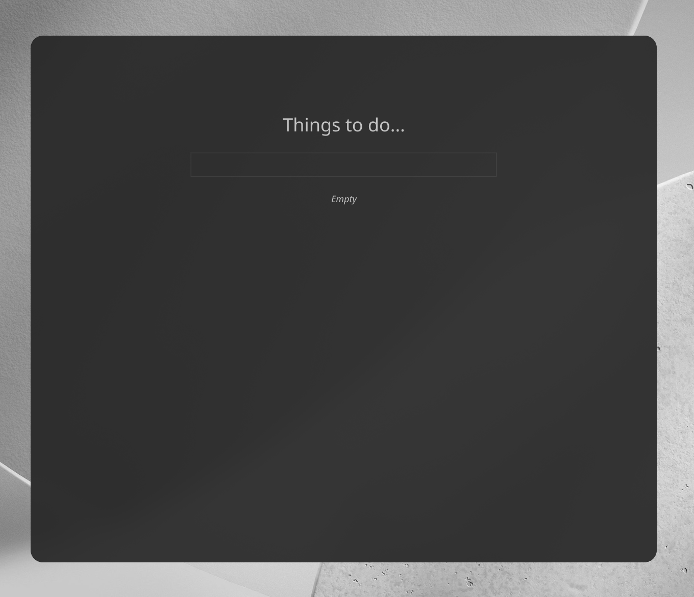
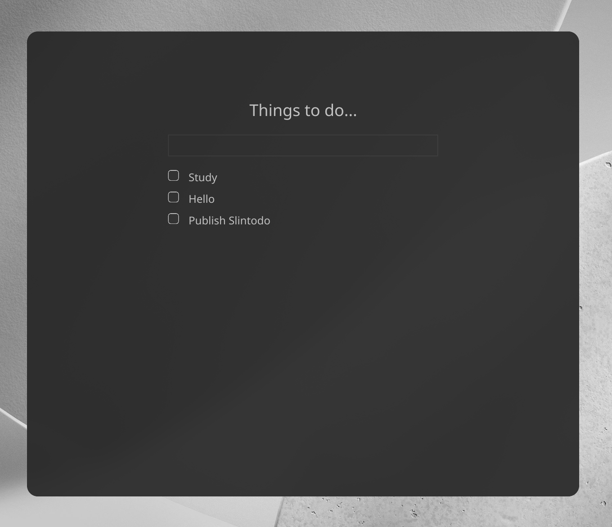
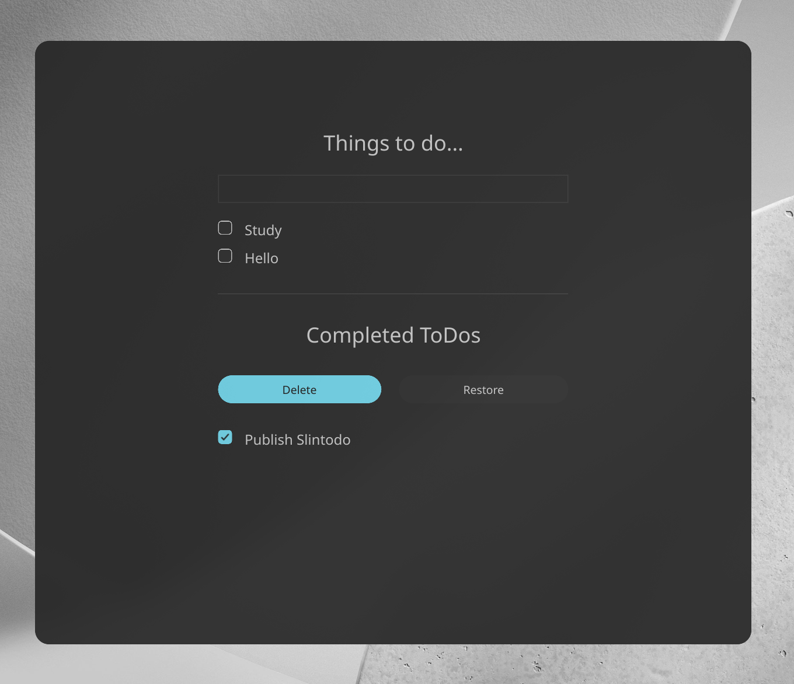

# Slintodo

A minimal ToDo app built with Rust and Slint.

I made this project mostly as a sandbox to see how Slint handles UI and how well it integrates with a Rust backend. I usually spend most of my time in the terminal, so I wanted to try building a declarative graphical interface and figure out how state management works in this framework.

## What's inside

- **Basic Task Management**: Just adding and removing tasks.

## Running it

Make sure you have Rust installed, then just clone and run:

```
git clone https://github.com/BudinoSurelySweet/slintodo.git
cd slintodo
cargo run
```

## Gallery

<p align="center">
	
	
	
</p>
